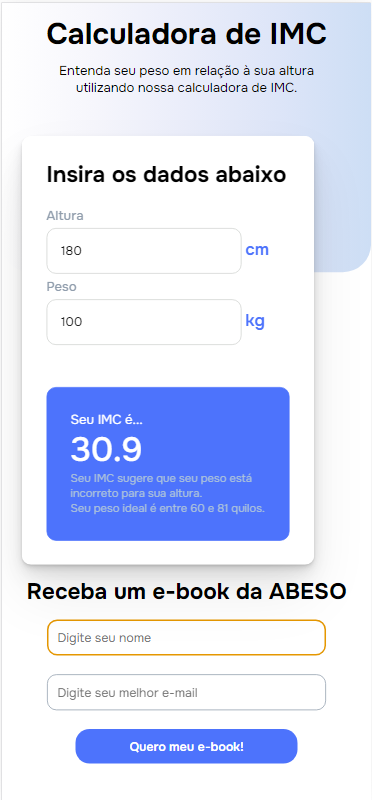
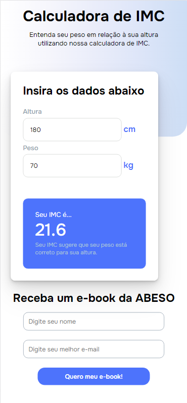
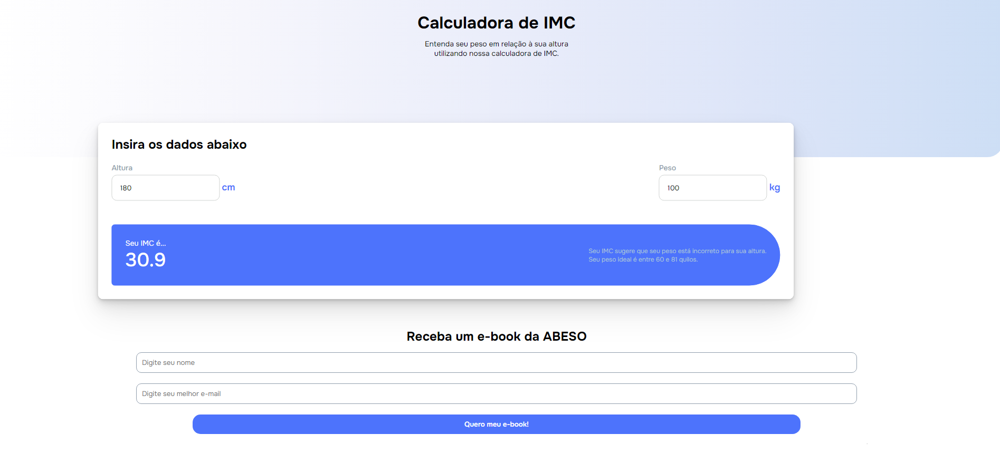

# Calculadora de IMC

## Visão Geral

O projeto consiste em uma calculadora de IMC. O usuário preencherá os dados de altura e peso e o sistema calcula o IMC.
Caso o resultado esteja abaixo do mínimo ou acima do máximo para ser considerado normal, o sistema retorna o intervalo de peso ideal.

O projeto conta também com um formulário para acessar um e-book da ABESO (Associação Brasileira para o Estudo da Obesidade e Síndrome Metabpolica) integrado à uma planilha do Google Sheets por meio do SheetMonkey (https://sheetmonkey.io/).
Os dados de "Nome" e "Email" preenchidos são captados e armazenados nesta planilha para posterior uso.

O projeto conta com responsividade para mobile e desktop.

## Screenshots

## Deploy

Link do deploy: https://lp-arquitetura-dnc.netlify.app/
